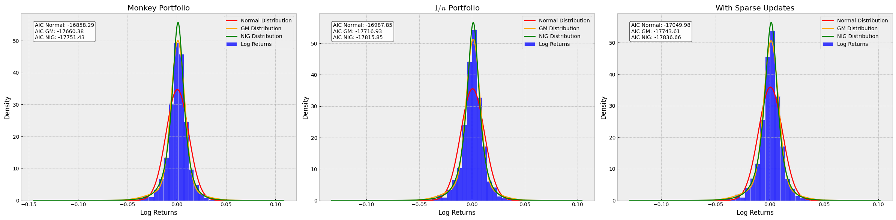
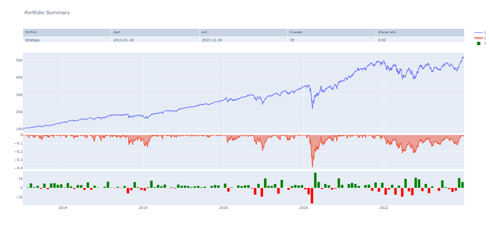

# Monkey Portfolios Revisisted
"A blindfolded monkey throwing darts at a newspaper's financial pages could select a portfolio that would do just as well as one carefully selected by experts."

## Introduction

In the influential work "A Random Walk Down Wall Street" by Burton Malkiel, first published in 1973, an intriguing idea was put forth: portfolios assembled randomly, as if by a monkey throwing darts at financial pages, could rival the performance of those meticulously crafted by seasoned experts. This notion, which resonates with the principles of the efficient market hypothesis, serves as the impetus for this repository. Herein lies a Jupyter notebook dedicated to the empirical exploration of Malkiel's theory, offering both the construction and the subsequent analysis of such "monkey" portfolios.

## Repository Structure

- `Monkey_portfolios_revisisted.ipynb`: The primary Jupyter notebook containing all the code and analysis for creating and evaluating the monkey portfolios.

## Getting Started

To run the analyses contained in this repository, follow these steps:

1. Open the `Monkey_portfolios_revisisted.ipynb` notebook in Jupyter Lab or Google Colab.

2. Run the notebook cells in order to execute the portfolio simulations and analyses.

## Portfolio Simulation

The notebook simulates the performance of randomly selected portfolios against a benchmark with variables such as the number of stocks (`n`) and the rebalance frequency (`f`). The simulation aims to estimate the performance and standard deviation of these synthetic indices relative to the benchmark.

## Convex Optimization

The repository showcases the use of convex optimization in the construction of portfolios with various objectives, such as minimizing the Euclidean norm of the weights or maximizing the entropy.

## Analysis

The notebook includes a detailed analysis of the generated portfolios, evaluating their performance and risk metrics such as the Expected Shortfall (CVaR) at a 95% confidence level.

# Portfolio Analysis Scenarios

In this repository, we explore three distinct portfolio construction scenarios to examine the role of randomness versus strategic asset selection in portfolio performance.

## Scenario 1: Monkey Portfolio

The *Monkey Portfolio* simulates randomly weighted portfolios to test the hypothesis that a random selection of assets could outperform a traditional capitalization-weighted index. This approach is rooted in the belief that subsequent price changes in securities are unpredictable and depart from historical prices randomly. Should these randomly constructed portfolios consistently yield superior returns before transaction expenses, it would suggest that luck may play a larger role in investment success than is commonly believed.

## Scenario 2: The 1/n Family

The `$1/n$` portfolio concept is grounded in an equal weighting strategy, rebalanced monthly (though other frequencies such as daily are also possible). Each portfolio represents the solution to a convex optimization problem, with methods designed to:

- Minimize the Euclidean norm of the weights.
- Minimize the `$\infty$` norm of the weights.
- Maximize the entropy of the weights.
- Minimize the tracking error relative to an equal weight (`$1/n$`) portfolio.

Furthermore, this scenario introduces an example with *sparse updates*, where the portfolio is only adjusted when the deviation from the target `$1/n$` portfolio exceeds a predefined threshold, as opposed to frequent rebalancing.

This technique of framing portfolio construction as a convex optimization problem is particularly beneficial when integrating additional constraints. It establishes a link between the equal weight portfolio and Tikhonov regularization and serves as a paradigmatic example within a spectrum of more complex portfolios.

## Scenario 3: Sparse Updates

In practical applications, frequent rebalancing of the portfolio may not be desirable or necessary. The *Sparse Updates* approach tolerates minor deviations from the exact `$1/n$` portfolio, aiming for a balance between performance and transaction costs. The portfolio is rebalanced to equal weights across all assets only if the change in weights since the last adjustment exceeds 20%. For changes less than this threshold, the current portfolio state is preserved.

# Output Example

The analysis of Expected Shortfall (CVaR) at the 95% confidence level across three different portfolio strategies reveals insights into their risk profiles:

### Monkey Portfolio
- **CVaR:** 0.064%
- **Interpretation:** This portfolio shows an expected loss of 0.064% on the worst 5% of trading days, suggesting a relatively low risk profile. The implication for risk management is that, despite its random selection process, the monkey portfolio's vulnerability to extreme losses is minimal, thus challenging the notion that expertly curated portfolios significantly outperform randomly selected ones in terms of risk.

### $1/n$ Portfolio
- **CVaR:** 0.061%
- **Interpretation:** The equal-weighted portfolio presents a slightly lower expected shortfall of 0.061%, indicating a marginally reduced risk of extreme losses compared to the monkey portfolio. This underscores the effectiveness of the $1/n$ strategy in distributing risk evenly across assets, thereby slightly mitigating the impact of adverse market movements.

### Sparse Updates Portfolio
- **CVaR:** 0.059%
- **Interpretation:** Exhibiting the lowest CVaR among the three, the sparse updates portfolio demonstrates an expected loss of 0.059% on the worst 5% of days. This result suggests that allowing for deviations from the target allocation, within a tolerance level before rebalancing, does not significantly increase risk. In fact, it marginally decreases the portfolio's exposure to extreme negative outcomes, offering a nuanced approach to balancing risk and transaction costs.

**Overall Analysis:** The relatively close CVaR values across all three portfolios suggest that the risk of extreme loss is comparably low, regardless of the selection or rebalancing strategy employed. This finding lends empirical support to the notion that market efficiency may render sophisticated selection strategies no more advantageous, in terms of risk management, than simpler or even random approaches. For a financial analyst, these outcomes highlight the importance of considering transaction costs and the practical benefits of simplicity in portfolio construction, without necessarily compromising on risk.

## Contributions

Contributions are welcome! If you have suggestions or improvements, please open an issue or pull request.

## License

This project is licensed under the Apache License, Version 2.0.

## Acknowledgements

- Burton Malkiel for the concept of monkey portfolios.
- Stanford University's Convex Optimization Group for convex optimization tools.
